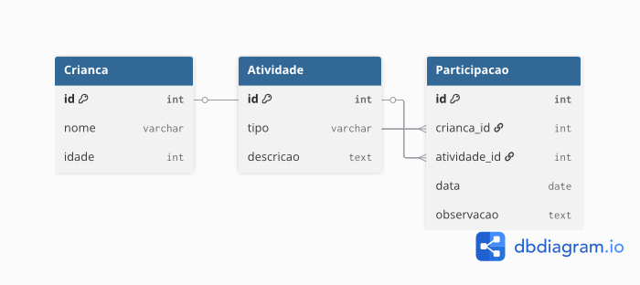

# 🎲 Brincando e Aprendendo a Falar 🗣️

Projeto desenvolvido no **PIT II - Sistemas de Informação**.  
O objetivo é apoiar o desenvolvimento da comunicação de crianças da Educação Infantil, utilizando atividades lúdicas (histórias, músicas e rodas de conversa).

> ℹ️ Este projeto é a continuação do PIT I, em que foi desenvolvida a proposta teórica da solução.  
> No PIT II, foi criada a parte prática, com aplicação web, banco de dados e documentação completa.
---

## 🌟 Objetivo
Estimular a fala e a convivência entre crianças por meio de uma interface simples, interativa e acessível para professores ou responsáveis.

---

## 🖥️ Tecnologias Utilizadas
- **HTML5** → estrutura da página  
- **CSS3** → estilização e layout  
- **JavaScript** → interatividade  
- **GitHub Pages** → hospedagem  
- **MySQL (modelo físico)** → banco de dados

---
## 📱 Ferramentas utilizadas

- **GitHub Mobile** → criação do repositório, upload de arquivos e publicação via GitHub Pages.  
- **Textor** → editor de texto para criação e edição de arquivos HTML, CSS e JavaScript.  
- **dbdiagram.io** → criação do diagrama ER do banco de dados.  
- **Google Fonts** → fonte personalizada para a interface.    


---

## 🚀 Como acessar
- 🔗 [Clique aqui para abrir o site](https://yarxcat.github.io/brincando-falando/)
- 📂 [Repositório com os códigos](https://github.com/yarxcat/brincando-falando)

---

## 📂 Estrutura do Projeto
- `index.html` → página principal  
- `style.css` → estilos visuais  
- `script.js` → interatividade  
- `banco.sql` → modelo físico do banco de dados  
- `modelo-er.png` → diagrama ER  
- `README.md` → documentação  

---

## 🛠️ Banco de Dados

### Modelo Conceitual
- **Criança** (id, nome, idade) → representa os alunos atendidos.  
- **Atividade** (id, tipo, descrição) → representa histórias, músicas e rodas de conversa.  
- **Participação** (id, criança_id, atividade_id, data, observação) → registra a participação de cada criança.  

👉 Uma criança pode participar de várias atividades.  
👉 Uma atividade pode ter várias crianças.  
👉 Relação **N:N**, resolvida pela entidade **Participação**.  

### Modelo ER
Aqui está o diagrama do banco de dados:  



### Modelo Físico (SQL)
O código para criação das tabelas está no arquivo **banco.sql**, mas o script principal é:  

```sql
CREATE TABLE Crianca (
  id INT PRIMARY KEY AUTO_INCREMENT,
  nome VARCHAR(100) NOT NULL,
  idade INT NOT NULL
);

CREATE TABLE Atividade (
  id INT PRIMARY KEY AUTO_INCREMENT,
  tipo VARCHAR(50) NOT NULL,
  descricao TEXT
);

CREATE TABLE Participacao (
  id INT PRIMARY KEY AUTO_INCREMENT,
  crianca_id INT NOT NULL,
  atividade_id INT NOT NULL,
  data DATE,
  observacao TEXT,
  FOREIGN KEY (crianca_id) REFERENCES Crianca(id),
  FOREIGN KEY (atividade_id) REFERENCES Atividade(id)
);

